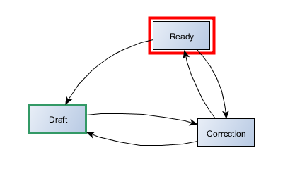

# Presentation

The simpleWorkflow extension is a set of Yii components that is dedicated to provide an easy way to manage the life cycle of CActiveRecord objeccs inside a workflow.

If you are already familiar with the concept of 'workflow' you can jump to the next chapter.
Definition

According to wikipedia :

> A workflow consists of a sequence of connected steps. It is a depiction of a sequence of operations, declared as work of a person, a group of persons, an organization of staff, or one or more simple or complex mechanisms. Workflow may be seen as any abstraction of real work, segregated in workshare, work split or other types of ordering. For control purposes, workflow may be a view on real work under a chosen aspect, thus serving as a virtual representation of actual work.

[read more on Wikipedia](http://en.wikipedia.org/wiki/Workflow)

Workflows (also called Petri net) is a vast subject and the aim of this document is not to go deeply in the theorical fields. As described in the next chapter, the simpleWorkflow extension only implements a simple subset of it. However, if you are intrested in better understanding theorical basis on the subject, you'll find some references at the end of this page.
Example

To demonstrate how the workflow concept can be used in a valuable way, let's consider a real life example that can be found embeded with all Yii framework releases : the Yii Blog Demo. This demo web app implements a basic blogging system where a user can write and publish posts. If you have ever installed and played with this demos, you may have noticed that a post may be in different states (or statuses), each one of them represented by constants values declared in the Post model itself.

`models/Post.php`
```php
class Post extends CActiveRecord { 
    const STATUS_DRAFT=1; 
    const STATUS_PUBLISHED=2; 
    const STATUS_ARCHIVED=3;
    // ...
```

It is quite obvious that theses statuses define possible states of a Post instance : the status is a property of the Post model. Moreover, a set of rules are used to define how posts will evolve among these 3 statuses : when you first create a post, it is defined as being *draft*, then it can be *published* or *archived*. A *published* post can become *draft* (it is then unpublished) or be *archived*. At last an *archived* post can be *published* or become *draft*.
What we have just described here are allowed transitions between different statuses of the Post, and if we try to give a graphical representation to this description, we'll end up with our first (and very simple) workflow.


Post workflow definition (Yii blog Demo):

- 3 statuses : *draft*, *published*, *archived*
- 6 possible transitions
- initial status : *draft*

To handle this very simple workflow, there is not much to do as the user has complete freedom to set a post status : any status can be reached from any other status. In this case, there is no need for a dedicated extension that would handle workflow logic.

Let's imagine something a little bit more complex.

Our new Yii blog system is now a multi-user publishing system, where each user is assigned tasks : some are redactors (reporter), some make corrections and layout work (they know css), and there is of course some chief editors who are responsible for publication.

If we want to be able to handle posts in our new publishing system, we must think of a more elaborated workflow that will fit this new organisation. First of all, let's list possible post statuses :

- *draft* : when created, a post is always draft
- *correction* : the post is being corrected and layout improvements may also be added
- *ready* : the post is ready to be published but not yet online
- *published* : the post is online, available to readers
- *archived* : the post is not directly available to readers, but can be accessed through the archive section of the site

That is not enough. Now we must define possible transitions between these statuses. These transitions strongly depend on how the work is going to be organized, how users of our publishing system will interact with each other. For this example we will abritrarly state following rules :

- A Post must always be corrected before publication
- the chief editor is responsible for publishing/unpublishing posts
- the chief editor is responsible for sending a post to archive

That will be enough for this example but of course there could (and probably should) be more rules.
Now, based on what we have just define, here is the Post workflow :


The first version of the Post worfklow was very simple, and as each status could reach any other status, there was no need for the developper to make any tests when a Post changed status. With this last version above, that's another story ! Some logic must be implemented in order for instance, to prevent *Archived* post to become *Draft*, or *Published* posts to be sent to *Correction*. That is when simpleWorkflow is useful.

# Introducing simpleWorklow

The simpleWorkflow extension handles status transitions for CActiveRecord based class. It provides following features:

- **Formal definition** : all workflow are defined and described as PHP associative arrays which can be stored in a particular folder, or for ease of use, directly provided by the owner model itself
- **Transition check**: the simpleWorkflow behavior enforces both status persistance and transitions, without having to modify the component it is attached to.
- **Transition tasks**: possibility to associated a business rule to each workflow transitions. When a transition is performed, associated buziness rule is evaluated in the context of the owner component.
- **Event model**: to define how the owner component will behave inside the workflow, a set of dedicated events are fired by the behavior.
- **Easy to use**: only requires basic configuration and to attach the behavior to the managed component to get basic features.
- **Minimum integration effort**: allow integration to existing architecture with minimal changes.

All the logic to handle workflow is located into a behavior that, once attached to a model, will handle status changes for this model. To provide information on workflow, the simpleWorkflow source component is also available.

## Get Started

### Download

Fastest way to get started: get the extension, unzip its contents in your extensions folder and configure it.

[Download simpleWorkflow](https://github.com/raoul2000/simpleWorkflow/archive/master.zip)

### Clone

You can also clone the git repository by heading to the GitHub project page and following the instructions there.

[simpleWorkflow on GitHub](https://github.com/raoul2000/simpleWorkflow)

### Configure

Next step is to modify the configuration of your web application. We need to import all files included in the extension, and to declare the `swSource` component.

`protected/config/main.php`	
```php
'import'=> array(
    // Import simpleWorkflow extension
	'application.extensions.simpleWorkflow.*',	
),
//...
'components'=>;array(
	// adding the simple Workflow source component
	'swSource'=> array(
		'class'=>'application.extensions.simpleWorkflow.SWPhpWorkflowSource',
	),
// etc ...
```

**installation** : it is assumed that the extension is installed into `protected/extensions/simpleWorkflow`. If you decide to change this location don't forget to update the configuration above accordingly.

The simpleWorkflow extension is now ready to be used.

## Yii blog Reloaded

Let's demonstrate on a real example, how the simpleWorkflow extension can be used. To do so, we will use the Yii blog demo webapp provided with all Yii framework releases. Our goal here is not to handle the very simple Yii blog default workflow, but the one a little be more complex that we imagined before.

### Workflow definition

First of all we must create the workflow definition file, and make it accessible to the simple workflow source component. In the current version of the extension, all workflows are defined as associative arrays. The excepted array structure is the following :

```
initial => (string) id of the one and only entry node
node => (array) list of node definition with the following structure
    id => (string) unique identifier for the node
    label => (string, optional) display name for the node
    constraint => (string, optional) php expression that is evaluated in the context of the owner component
    transition => (mixed, optional) list of ids for all nodes than can be reached from this node.
    This list can be a coma separated string or an array.
```

Let's define this workflow :


We have a list of 5 statuses : *draft*, *ready*, *correction*, *published* and *archived*. The initial status id is *draft*. All transitions between statuses are represented in the figure above. The workflow definition is then :

```php
array(
	'initial' => 'draft',
	'node' => array(
		array('id'=>'draft',     'transition'=>'correction'),
		array('id'=>'ready',     'transition'=>'draft,correction,published'),
		array('id'=>'correction','transition'=>'draft,ready'),
		array('id'=>'published', 'transition'=>'ready,archived'),
		array('id'=>'archived',  'transition'=>'ready'),
	)
)
```

Note that no 'label' has been defined, and in this case the simpleWorkflow behavior will use the status id as the label.
This definition describes only possible transitions between statuses, and that's enough for now.

Next is make this definition available to the workflow source component (swSource) that we have previously added to the configuration file. By default, this component assumes that workflows are stored in `application.models.workflows` but this can be changed if you prefer to store them in another folder. For this example, the default will be fine.

The workflow definition must come in the form of a PHP file that is evaluated as the workflow definition array itself (the one we have just created). The name of the file must be the same as the name of the workflow. As this workflow implement posts statuses, we will name it **swPost**.

Let's go !

- Create folder workflows under `protected/models`
- Create file `swPost.php` in the workflows folder
- Copy the workflow definition below in `swPost.php`, save and close

`protected/models/swPost.php `
```php
<?php
    return array(
    	'initial' => 'draft',
    	'node' => array(
    		array('id'=>'draft',     'transition'=>'correction'),
    		array('id'=>'ready',     'transition'=>'draft,correction,published'),
    		array('id'=>'correction','transition'=>'draft,ready'),
    		array('id'=>'published', 'transition'=>'ready,archived'),
    		array('id'=>'archived',  'transition'=>'ready'),
    	)
    )
?>
```

## <a href="http://youtu.be/F1lJFlB-89Q">Oh behave !</a>

Our workflow is ready to be used and for all posts instances to behave correctly inside this workflow, we must attach the *simpleWorkflow* behavior to the Post model. This is done by adding the correct behavior class name to the behavior method inside the Post model. For more information please refer to the [Definitive Guide to Yii](http://www.yiiframework.com/doc/guide/extension.use#behavior).

`protected/models/Post.php`	
```php
public function behaviors()
{
    return array(
        'swBehavior'=>array(
            'class' => 'application.extensions.simpleWorkflow.SWActiveRecordBehavior',
        ),
    );
}
```

This step and the next one are required because we are using an existing web application that we must modify so it can support the *simpleWorkflow* extension.The workflow design is an early process that should normally be done at the begining of the application development, and integrated in the architecture.

- One important thing to remember is that simpleWorkflow needs to be able to store the current status of an active record object into a column which must be of type string. The Yii blog demo defines the status column as an integer and so we must change this before being able to continue.
    - Change status column type in table Post to VARCHAR(50)
- For this example, we need to delete all existing records from the Post table. Please note that it would be possible to keep these records by defining status ids that match the one currently stored in the table (numerical values). However, to keep this example simple, choose not to do so.
    - clear the Post table

## Source code

Again, the existing Yii blog demo was not designed to use the *simpleWorkflow* extension, so we must now modify some (but not that much) of its code. First one will be the Post model.

- The Post Model
- The form
- The Admin view

Original status validation is not needed anymore and it should be replaced by the default *simpleWorkflow* Validator. This validator will ensure that no undefined transition is applied to the Post.

`protected/models/Post.php`
```php
// replace...
array('status', 'in', 'range'=>array(1,2,3)),

// ...with
>array('status', 'SWValidator'),
```
 
The original form displayed all possible statuses as a dropdown list. As any status could be reached from any other status, the dropdown list always contained the complete status list, and it is now incompatible with our new workflow.
We only want to display the list of statuses *that can be reached from the current Post status*. To do so, we are going to use a helper method : `SWHelper::nextStatuslistData()`

`protected/views/post/_form.php (line 37)`
```php
// replace...
echo $form->dropDownList($model,'status',Lookup::items('PostStatus'));

// ...with
echo $form->dropDownList($model,'status',SWHelper::nextStatuslistData($model));
```

At last, we must modify the admin view implemented as a `CGridView` widget (`zii.widgets.grid.CGridView`), and more precisely, the 'status' column definition. Again we are going to use the SWHelper class in order to get the complete list of statuses for our Post model.

`protected/views/post/admin.php (line 19-20)`
```php
// replace ...
'value'=>'Lookup::item("PostStatus",$data->status)',
'filter'=>Lookup::items('PostStatus'),
    
// ... with
'value'=>'CHtml::encode($data->status)',
'filter'=> SWHelper::allStatuslistData($model),
```

That's it, we are done ! With not so many changes, our Blog application is now able to handle our new workflow: the simpleWorkflow extension garantees that a Post will correctly evolve through the workflow and that for example, a Post that is published has first been corrected.


## Principles

The main class is the `SWActiveRecordBehavior` which is nothing but a standard behavior that will manage how its attached model will behave. This model, must have a specific attribute that is used to store the current status. By default, this attribute should be named 'status' but it is possible to configure the attribute name you want to use, when declaring the behavior. This attribute must be defined as a 'string' because that's the internal representation implemented by the simpleWorkflow extension.

Each time the status attribute is modified (by a massive assignement or programatically by direct assignement) the simpleWorkflow behavior is not invoked because this is not considered as a real status modification. But when the attached Active Record is about to be saved, then the simpleWorkflow behavior will perform some tests and validation on the value of this 'status' attribute. It is compared with the internal status value that is stored by the behavior and not directly accessible (private member). If the model status differs from the internal simpleWorkflow behavior status, then we have a possible transition about to be applied to the model. This transition needs to be validated, and if it is a valid transition, the model status is updated before the model is actually saved.

It is important to understand that there are 2 status values :

- the model attribute called 'status' and that can be modified directly
- the simpleWorkflow behavior attribute, that can't be modified by assignement and which represent the real status of the model within its workflow

Synchronization between both statuses occurs at different time during the life cycle of the owner model :

- **construction** : when the model is first created (by a new command for instance), the internal status is initialized to its default value which is the initial status from the default model workflow. This is called auto-insertion and can be modified by configuration
- **Read from database** : when a model is created as the result of a find command (for instance findByPk()) the simpleWorkflow behavior automatically update its internal status value, with the one retrieved from the database.
- **Save to database** : when a model is about to be saved, the simpleWorkflow behavior automatically verify that the model status is the same as the internal simpleWorkflow behavior status. If it's not the case, a possible transition is detected and processed by the simpleWorkflow behavior.

As you may have already guessed, the simpleWorkflow behavior is using method overloading and `CActiveRecord` events to include its own workflow logic to an existing model. A specific handler is installed to the model in order to process following Active Record events : *afterFind*, *beforeSave*, *afterSave*

# Workflow Tasks

Being able to garantee that the model status will only use authorized transition is nice, but the simpleWorkflow extension provides a way to add some logic to worfklows.


A workflow task is a simple PHP expression linked to a given transition. When the transition is performed by a model the workflow task is evaluated in the context of the model. To illustrate this feature, let's imagine that we want to improve our Blog system.

We have noticed that people in charge of correction are not so reactive which increases the publication delay. They say it's because they never know when a new post is ready to be corrected and so, we decide to improve our Blog by sending an email to all correctors, as soon as a new post is requesting correction.

This can be achieved very easely by adding a task to our workflow, on the transition between the *draft* and the *correction* status.

In the (incomplete) workflow representation on the right, a task is symbolized by a little green square attached to a transition. To define a workflow task we must modify the workflow definition we made earlier. The transition value should now be specified as an array instead of a string: array key represent the (next) status id, and array value is the task itself (the PHP expression).

```php
<?php
return array(
	'initial' => 'draft',
	'node' => array(
        array( 
            'id'=>'draft',
            'transition'=>array( 'correction' => 'Yii::app()->mailManager->sendCorrectionMail()' 
        ),
		// etc ...
	)
)
?>	
```

Of course, we are assuming here that we have a mailManager component ready to be used and that this component has a methode called sendCorrectionMail.

To understand exactly when is the task transition executed, please refer to the Events chapter.

# Status constraints

Status constraints are conditions which are evaluated in the context of the owner model (the model attaching the simpleWorkflow extension). When the result of this evaluation is FALSE, the corresponding status is not accessible, otherwise the status is normally accessible.



Constraints on status bring an additional level of flexibility in the workflow managment as they allow to define a dynamic workflow which can be viewed as a subset of the complete workflow depending on external context.

Let's see that on an example.

The group of person in charge of correction has been re orgranized : one of them (Bob) has been assigned the responsability to check that the work has been correctly done, and to actually send posts into the *Ready* status. The blog system has been improved, it now includes an authorization module (rbac) and a dedicated permission item has been created for Bob : 'validateCorrection'. Bob is today the only one that can 'see' the Ready status, which is hidden from all other correctors.

How can we modify the workflow to take this new organisation rule into account ? One simple solution provided by the simpleWorkflow extension is to add a constraint on the Ready status, so it is not accessible by a user who doesn't have the appropriate permission.

this can be easely done by modifying our workflow definition :

```php
<?php
return array(
	'initial' => 'draft',
	'node'    => array(
		// ....
		array(
			'id'=>'ready',
			'constraint'=>'Yii::app()->user->checkAccess('validateCorrection')',
			'transition'   =>'draft,correction,published'
		),
		// ...
	)
)
?>
```

Note that we did not modify real transition between statuses. Status Correction is still linked to Ready, but under certain circumstances, status Ready can't be reached from status Correction.

**Warning** : It is important to understand that constraints are not designed to replace model validation and so they should not refer to model attributes. This is because constraint evaluation occurs each time a list of accessible status for a given model is required, and not only when the model is actually validated.

# Workflow Driven Validation

## The basis

When dealing with complex workflows, where model validation rules are strongly related to statuses, and user interaction is required, attributes validation can quickly become a nightmare to handle. In such a case, constraints are not appropriate as they should only rely on a condition which are external to the model and its attributes.
To handle model validation in this context, the simpleWorkflow extension provides a mechanism that integrates to the standard Yii Validation process.

The simpleWorkflow extension provides a dedicated validator to be used like any other Yii validator : `SWValidator`.

It can be used for :

- **status validation** : the `SWValidator` can be used to check that the user has sent the model into a status which is accessible from its current status. Of course this can be done programmatically, by calling directly one of the method defined by the simpleWorkflow behavior (e.g. swIsNextStatus()), but the `SWValidator` can conviniently be declared in the 'rules' method of the owner model.
- **attributes validation** : if the `SWValidator` is correctly configured, it not only validates the status change, but also invoke all validators that may have been defined for the current transition. 

Again, let's see that on an example.

In our blog system, a Post has various attributes : category, tags, priority, etc... These attributes are not set at the Post creation but at different moment of its exitence in the workflow. For instance, we decide that the author must give a category to the Post, the correction team is in charge of adding tags, and at last the chief editor is responsible for setting a priority to the Post.

In terms of validation rules for the Post model, this new requirement can be said this way :

- When the Post is sent from Draft to Correction status, is must have a category
- When the Post is sent from Correction to Ready status, is must have tags
- When the Post is sent from Ready to Published status, is must have a priority

At validation time, we must check that the next status can be reached and that our rules apply on other attributes. This can easely be done using the SWValidator features.

First let's see how to validate the status change:

```php
public function rules()
{
	return array(
		array('status','SWValidator'),
		// other validators ...
	);
}
```

Second, let's see how to validate model attributes (other that status) depending on workflow transitions :

```php
public function rules()
{
	return array(
		array('status',  'SWValidator','enableSwValidation'=>true),
		array('category','required','on'=>'sw:Draft_Correction'),
		array('tags',    'required','on'=>'sw:Correction_Ready'),
		array('priority','required','on'=>'sw:Ready_Published'),
		// other validators ...
	);
}
```

Could it be more simple ?

If parameter `enableSwValidation` is set to TRUE, once the status model change has been validated, the SWValidator validator will :

- dynamically create a scenario name for the transition
- fetch all validators (for the model) that apply to this scenario
- execute those validators them on the model

### Transition Scenario

If the SWValidator is configured to run attributes validation on transition, it is important to understand that scenario names are automatically created for each transition. The format of such scenario name must be : `sw:[startStatus]_[endStatus]`

Consequently, you must set the appropriate scenario name for those validators dedicated to be used on workflow transitions. For instance, in the previous rules set declaration, the 'required' validator will be applied on the category attribute when the model is sent from status Draft to Correction.
In the same way, the tags attribute is required when the model is sent from Correction to Ready, etc...

### Advanced Transition Scenario

Using scenario names as defined above, to trigger model validation on status change may become quite complex when the workflow reaches a certain size. Imagine you want to implement a validation rule like : all model that leave the status 'Correction' must have tags. For our small workflow, that's no big deal because we only have 2 outgoing transitions from the 'Correction' status. We just have to write :

```php
public function rules()
{
	return array(
		array('status',  'SWValidator','enableSwValidation'=>true),
		array('category','required','on'=>array('sw:Correction_Ready','sw:Correction_Draft'),
		// other validators ...
	);
}
```

What if we had 10 outgoing transitions ?

What if we want to implement a rule that would say 'all model that enter into status 'Ready' must have tags' ?

We could end up adding a lot of scenario which indeed would make our validation rules quite complex to understand.
In such a case, the SWValidator can be configured to consider that validator scenario are not constant strings, but regular expressions that should match the current transition scenario name. The previous example could then be implemented in a very easy way :

```php
public function rules()
{
	return array(
		array('status',  'SWValidator','enableSwValidation'=>true,'match'=>true),
		// all models leaving the 'Correction' status, must have a category
		array('category','required','on'=>'sw:/Correction_.*/'),
		
		// all models that enter the 'Ready' status must have tags
		array('tags','required','on'=>'sw:/.*_Ready/'),
		// other validators ...
	);
}
```

# Events

In order to allow a high control level on the model inserted in a workflow, the simpleWorkflow extension defines a set of custom events which are fired when different time. These events are dedicated to be handled by a custom behavior created by the user to the extension. They offer another way (other than tasks and constraints) to add logic at the workflow level.

Following events are available :

- **onEnterWorkflow** : the model has been inserted into a workflow.
- **onBeforeTransition** : the model status is about to be changed. The transition that will be performed is valid which implies that it exists and that if a constraint is associated with the destination status, it has been evaluated as TRUE
- **onTransition** : the model is changing status
- **onAfterTransition** : the model has reached its destination status
- **onFinalStatus** : the model is in a status that has no outgoing transition

Workflow events are a powerful way to customize the default workflow behavior for a given model. However, they require to be familiar with internal simpleWorkflow process. In order to be used correctly it is important to understand when these event are fired.

When is transition done ?

When the status is changed because the record instance is saved, events onTransition, onAfterTransition and possibly onFinalStatus may be fired before or after the record is actually saved, depending on the transitionBeforeSave initialization parameter.

By default this parameter is set to TRUE so these 3 events are always fired before the record instance is saved. This must be taken into account if, for example, an event handler is refering to an auto-incremented column whose value is set only after the record is saved. In such case the behavior must be initialized with transitionBeforeSave to FALSE.

On the other hand, the simpleWorkflow extension provides an API that allows the developper to change status. When the `swNextStatus($nextStatus)` method is used, the transitionBeforeSave has no effect, as the record instance is not saved.

# API Documentation

The simpleWorkflow extension includes a complete API that can be used to set and modify the status of a given record programatically. All methods defined in this API starts with 'sw' and are associated with the simpleWorkflow behavior so they can be invoked directly on the attaching model.

For example, the code below loads a record from DB, and check if it already has a status. If it's not the case, insert it into its default workflow.

```php
$m=MyModel::model()->findByPk('1');
if( $m->swHasStatus() ){
	echo 'status : '.$m->swGetStatus()->toString();
}else {
	$m->swInsertToWorkflow();
	$m->save();
}
```

The API documentation is available [here](./api/index.html). In particular you may be intrested in the `SWActiveRecordBehavior` class which implements all the simpleWorkflow logic.

# References

Now that you know a little be more about the simpleWorkflow extension, it is obvious that its purpose is not to provide a workflow driven model that would replace MVC. It should only be considered as a set of tools that facilitate workflow managment for simple applications.

If you want to know more about the subject, and discover what a complete workflow engine looks like, here is a list of intresting links (my inspiration).

- [An activity based Workflow Engine for PHP](http://www.tonymarston.net/php-mysql/workflow.html#modelling)
- [Workflow Patterns home page]
- [Galaxia : an open source workflow engine]
- [ezComponent : workflow]

